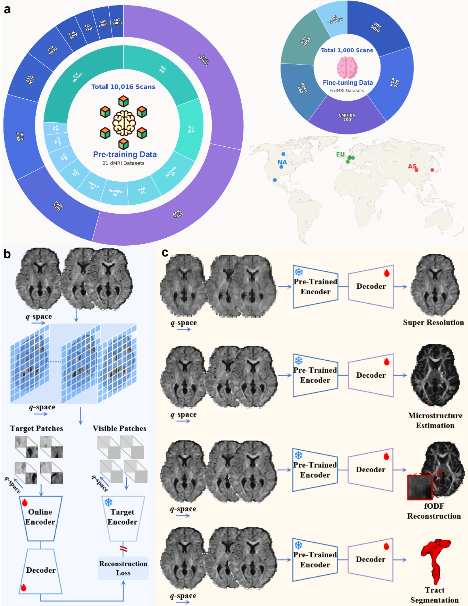
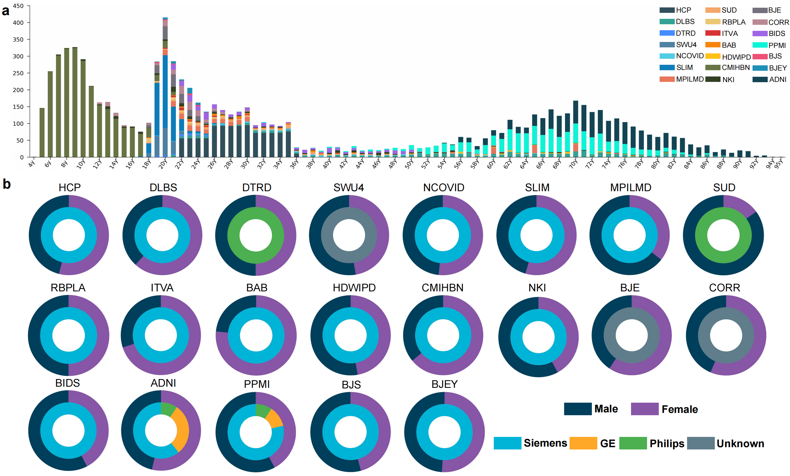
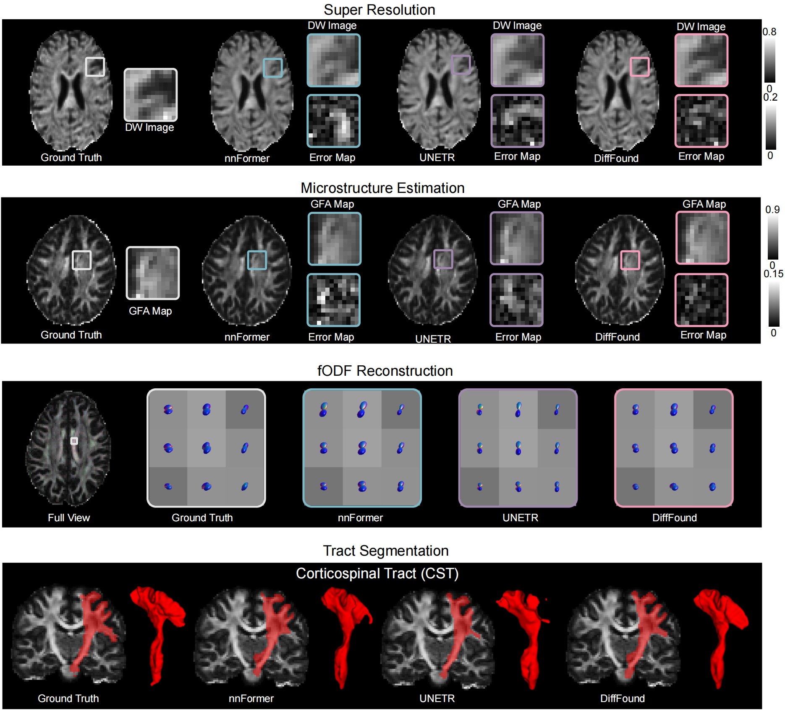

# 🧠 DiffFound: Towards a Universal Foundation Model for Diffusion MRI Computing


Official implementation code for DiffFound, a novel universal foundation model for diffusion MRI (dMRI). DiffFound demonstrates exceptional versatility and state-of-the-art performance across a wide range of critical dMRI computing tasks with minimal fine-tuning.
***
## 📋 Model overview
<div style="text-align: center">
  
</div>

## 📊 Dataset Information
<div style="text-align: center">
  
</div>

## 📈 Results
<div style="text-align: center">
  
</div>

***
# 🛠️ Installation
To ensure a clean workspace and prevent dependency conflicts, we strongly recommend creating a new Conda environment before running the code.
## 1. Create and Activate Environment
```bash
# Create a new conda environment named 'brainseg' with Python 3.9
conda create -n diffound python=3.8 -y

# Activate the environment
conda activate diffound

# Install the required libraries
pip install -r requirements.txt
```

***
# 🚀 Quick Start
## ⚙️ Step 1: pre-training 
1. Place all your data files (in .npy format) under a unified directory, for example:

```bash
data/
├── hcp_195950.npy
├── child_sub-NDARKT312RUD.npy 
├── max_sub-032520.npy 
└── ……
```

2. Create a text file (e.g., data_list.txt) and write the full path of each data file line by line:
```bash
path/data/hcp_195950.npy
path/data/child_sub-NDARKT312RUD.npy
path/data/max_sub-032520.npy
# Continue adding paths for all other data files...
```

3. Specify the path to your data list file in the configuration file configs_pretrain/lmim.yaml under the data_path field:
```bash
  data_path: "path/to/your/data_list.txt"  # Replace with your data list file path
  # Other configuration parameters...
```
4. Now you can start training DiffFound.

```bash
python launcher_pretrain.py 
```

## ⚙️ Step 2: fine-tuning 

1. You can organize your file directory as follows to train DiffFound on your own data

```bash
├── data/
│   ├── hcp_195950.npy 
│   ├── child_sub-NDARKT312RUD.npy     
│   ├── max_sub-032520.npy           
│   ├── ……                                     
├── gt/
│   ├── hcp_195950_gt.npy        
│   ├── child_sub-NDARKT312RUD_gt.npy        
│   ├── max_sub-032520_gt.npy            
│   ├── ……     
├── mask/
│   ├── hcp_195950_mask.nii.gz        
│   ├── child_sub-NDARKT312RUD_mask.nii.gz         
│   ├── max_sub-032520_mask.nii.gz             
│   ├── ……              
└── ……
```
2. Create input text file and write the full path of each data file line by line.
For Training Data:
Input Data List (data_list.txt): Contains paths to your training input files
Ground Truth List (gt_list.txt): Contains corresponding ground truth file paths\
Example data_list.txt:
```bash
path/data/hcp_195950.npy
path/data/child_sub-NDARKT312RUD.npy
path/data/max_sub-032520.npy
# Add paths for all training data files...
```
Example gt_list.txt:
```bash
path/gt/hcp_195950_gt.npy
path/gt/child_sub-NDARKT312RUD_gt.npy
path/gt/max_sub-032520_gt.npy
# Add paths for corresponding ground truth files...
```
For Testing Data:
Follow the same format to create test data lists:

Test Input Data List (test_data_list.txt)
Test Ground Truth List (test_gt_list.txt)
Ensure corresponding files maintain the same order in both training and testing lists.

3. Specify the path to your data list file in the configuration file configs_onetask_finetune/lmim.yaml under the data_path field:
```bash
  data_path: "path/to/your/data_list.txt"
  data_gt_path: "path/to/your/gt_list.txt"
  test_data_path:  "path/to/your/test_data_list.txt"
  test_data_gt_path: "path/to/your/test_gt_list.txt"
  mask_data_path: #mask data path
  mask_name: #mask data name eg: mask.nii.gz
```
4. Now you can start finetune super resolution, microstructure estimation, fiber orientation distribution function reconstruction, and tract segmentation tasks.

```bash
python launcher_finetune_super_resolution.py
python launcher_finetune_microstructure_estimation.py
python launcher_finetune_fodf_estimation.py
python launcher_finetune_tract_segmentation.py
```

5. Now you can start test super resolution, microstructure estimation, fiber orientation distribution function reconstruction, and tract segmentation tasks (config file is the same as 3).

```bash
python launcher_test_super_resolution.py
python launcher_test_microstructure_estimation.py
python launcher_test_fodf_estimation.py
python launcher_test_tract_segmentation.py
```

***
## 📖 Citation
If you find this work useful in your research, please cite:
> **Geng Chen<sup>#</sup>, Haotian Jiang<sup>#</sup>, Han Zhang, Xuejun Qian, Yong Xia, Yanning Zhang, Dinggang Shen. DiffFound: Towards a Universal Foundation Model for Diffusion MRI Computing. (Under Review)**

## 🙏 Acknowledgments
This work was supported by the National Natural Science Foundation of China\
We gratefully acknowledge the [LatentMIM](https://github.com/yibingwei-1/LatentMIM) codebase as the foundation of our implementation. 

## 📧 Contact
For questions or suggestions, please contact:

Haotian Jiang: jianghaotian@mail.nwpu.edu.cn\
Geng Chen: geng.chen@ieee.org
